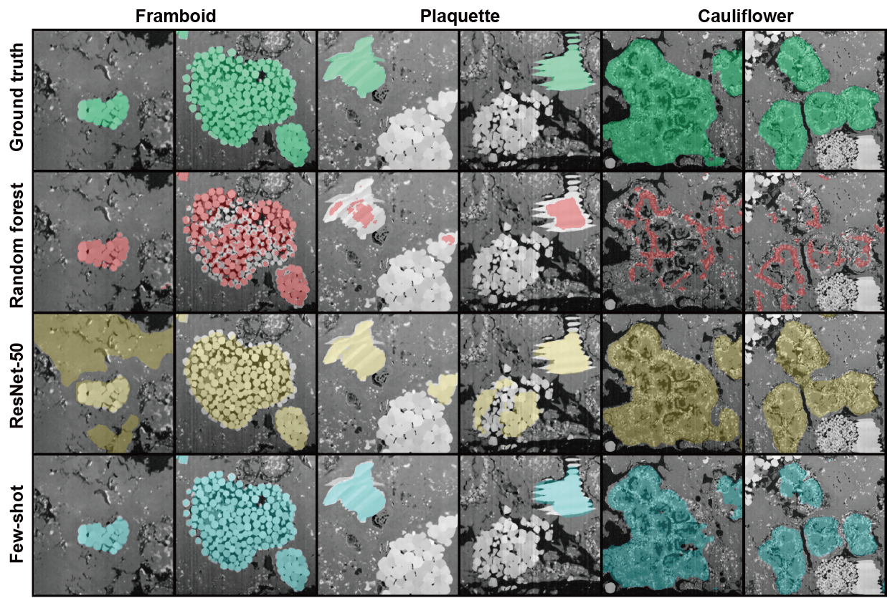

## Few-shot-segementer

`few-shot-segmenter` is an open-source Python code for complex microstructure segmentation, mainly built with [Pytorch](https://pytorch.org/). 

## Benchmarks

We benchmark this model against [Trainable Weka Segmentation](https://academic.oup.com/bioinformatics/article/33/15/2424/3092362?login=true) and [DeepLabV3-ResNet-50](https://arxiv.org/abs/1606.00915) on a 3D tomographic carbonaceous chondrite meteorite dataset. We use the metric of Intersection of Union (IoU) calculated between the model prediction and the ground truth along 1000 images in the dataset.<br />

| Model           | Framboid   | Plaquette  | Cauliflower | Average     |
| :-------------- | :--------: | :--------: | :---------: | :---------: |
| Trainable Weka  | 68.42      | 17.70      | 12.65       | 35.17       |
| ResNet-50       | 65.02      | 38.34      | 70.14       | 57.83       |
| 5-shot          | **94.05**  | **71.24**  | **76.59**   | **80.62**   |

<br />

3D visualisation of the segmentation results using [Dragonfly](https://www.theobjects.com/dragonfly/).

<div align="center">
    
</div><br />

Qualitative analysis on the segmentation results done by different models.

<div align="left">
     
</div><br />


## Installation

#### 1. Environment setup
Create a [Python>=3.9](https://www.python.org/) environment with [Conda](https://docs.conda.io/en/latest/):
```
conda create -n fewshot python=3.9
conda activate fewshot
```

#### 2. Installation 
Install **few-shot-segmenter** from source using [pip](https://pypi.org/project/pip/):

```
git clone https://github.com/poyentung/few-shot-segmenter.git
cd few-shot-segmenter
pip install -e ./
```

## Getting Started

#### 1. Prepare data and masks
`demo_data/` folder structures all the necessary images for training and evaluation.

```
# Training data
datapath/
    └── specimen/            
        ├── phase0/
        │   ├── annotation/        # target masks
        │   └── image/             # input images
        ├── phase1/
        │   ├── annotation/
        │   └── image/
        └── ...
```
```
# Evaluation data
datapath/
    ├── query_set/  
    │       ├── iamge1.tiff
    │       ├── iamge2.tiff
    │       └── ...
    ├── (optional) query_ground_truth/                     
    │       ├── phase0/
    │       │   ├── mask1.tiff       
    │       │   ├── mask2.tiff       
    │       │   └── ... 
    │       ├── phase1/
    │       │   ├── mask1.tiff
    │       │   ├── mask2.tiff
    │       │   └── ...
    │       └── ...
    └── support_set/            
            ├── phase0/
            │   ├── annotation/      # target masks
            │   └── image/           # input images
            ├── phase1/
            │   ├── annotation/
            │   └── image/
            └── ...
```

#### 2. Setup configuration file 
All the config parameters for training modules are saved in the folder [conf/](few-shot-segmenter/conf/), and overidden by `train.yaml` and `train.yaml`. For example, we can set the data augmentation of the datamodule in [train.yaml](conf/train.yaml):
```
......

datamodule:
    # Configuration
    datapath: ${original_work_dir}/demo_data/train    # directory of training data
    nshot: 3                                          # number of shot for the episodic learning technique
    nsamples: 500                                     # number of images (256*256) cropped from the large image for training

    # hyperparams
    val_data_ratio: 0.15                              # proportion for validation data
    batch_size: 5                                     # batch size for each mini-batch
    n_cpu: 8                                            

    # Data augmentation
    contrast: [0.5,1.5]                               # varying contrast of the image with the boundary condition
    rotation_degrees: 90.0                            # randomly rotate the image up to 90 degree before cropping
    scale: [0.2,0.3]                                  # randomly rescale the image before cropping
    crop_size: 256                                    # crop size of the image for training
    copy_paste_prob: 0.15                             # probability of copy-paste for the training data

......
```

#### 3. Training model

Run the training with 10 epochs:
```
python train.py trainer.max_epoch=10
```

We can also override some of the parameters directly on the commandline. For example,
```
python train.py model_name=test2 datamodule.nshot=5 datamodule.batch_size=10
```

#### 4. Evaluation
We only segment single phase each time when we call the function. Please note that this process is GPU-memory-intensive - please reduce the number of `annotator.batch_size` if the relevant error is present. The specified `phase` in the commandline is the filename in the [data folder](demo_data/train/carbon-chondrite-3slice). For example, if we want to segment `cauliflower` with the model `test` (specified as model_name in the `yaml` file) and a batch_size of 5, we can run:
```
python segment.py model_name=test phase=cauliflower annotator.batch_size=5
```

We can also segment multiple phases in a run:
```
python segment.py --multirun phase=framboid,plaquette,cauliflower
```

See the [example notebook](few_shot_segmentation.ipynb) on few-shot-segemnter model training and predictions for more details.

## License
Few-shot-segmenter is released under the [GPL-3.0 license](LICENSE).